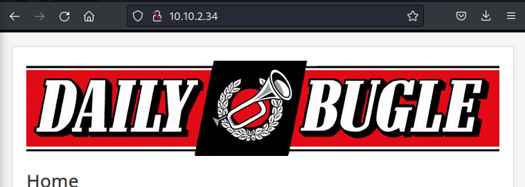

<h1>Daily Bugle</h1>
ompromise a Joomla CMS account via SQLi, practise cracking hashes and escalate your privileges by taking advantage of yum.
Start the Machine in the Try Hack me.

Open the IP address in your browser or your machine. or you can connect to the vpn provided by tryhackme and now you can use the ip address in your own browser.

let's start to attack on the webbrower.
The first answer to the question is : spierman as you can see in the webserver.

First problem solved!

<h1>Obtain user and root </h1>
Let's start to search for the hidden directories.
Using gobuster.
We got a output

As listed by the nmap scan, a ‘robots.txt’ disallows a couple of directories (some also found on the Gobuster search):

Now using searchsploit 

Neat! So we do have an exploit available. Let’s have a look into it: