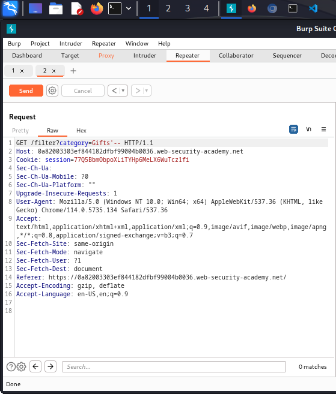

SQL injection

What is SQL injection (SQLi)?

SQL injection (SQLi) is a web security vulnerability that allows an attacker to interfere with the queries that an application makes to its database. It generally allows an attacker to view data that they are not normally able to retrieve. This might include data belonging to other users, or any other data that the application itself is able to access. In many cases, an attacker can modify or delete this data, causing persistent changes to the application's content or behavior.

In some situations, an attacker can escalate a SQL injection attack to compromise the underlying server or other back-end infrastructure, or perform a denial-of-service attack.


<h1>Lab: SQL injection vulnerability in WHERE clause allowing retrieval of hidden data </h1>
1. Open burpsuite and click on the proxy

 
2. Open the Lab link 

```https://0a0200da04c7bbdc811ddef7007b0093.web-security-academy.net/```
3. Open the link,make sure the intercept is on and click on the gift section.


4. Take the intercept and sent it to the repeater


5. Edit the `GET /filter?category=Gifts'-- HTTP/1.1`

Hence solved


<h1>Lab: SQL injection vulnerability allowing login bypass</h1>

1. You have to open the my account in lab

2. Intercept is on and add some values on the username and password.

3. you will get a response with username=aa and password= 
4. edit the link as username=administrator'--
5. Send it to the repeater and click on the `send`
6. Solved


